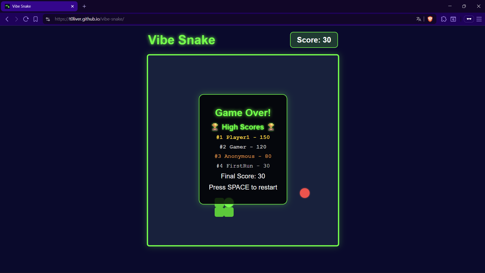

# Documentation of the prompting process

I used Github's Copilot as my little helper through this process.

## Start the repo with a Copilot prompt!

So first I started with and empty GitHub repository and right at the beginning I found a "Get started with Copilot" tab where I could give a promot and this little guy would work on that and add the right files to the repository through a pull request. So I gave in the next prompt:

> Write the snake game in React!
> Let the playground be a 100 x 100 square with a nice border.
> Let the snake be green and the background very dark blue.
> And add score too!
> The move should be with arrows or with wasd.

After waiting a bit the agent commented the following TODO list for itself:

> - [ ] Set up React project with Create React App
> - [ ] Create basic Snake game component with 100x100 grid
> - [ ] Implement snake movement with arrow keys and WASD controls
> - [ ] Add green snake styling on dark blue background
> - [ ] Add nice border to the playground
> - [ ] Implement food generation and consumption
> - [ ] Add score tracking and display
> - [ ] Add game over and restart functionality
> - [ ] Test and validate the complete game functionality

...just based on the prompt I gave in.

And I could follow the steps it does under an "Agents page" and see how the copilot was working on this project.

The steps were really detailed and wrote every changes and sometimes conflits in the code.

## First human review

In a opened pull request I could see the result of my prompt: a working (or it looks like working) snake game just delivered by my little helper.

In the pull request I even ran the app somewhere and then took a screenshot of it how our game looks like! *How cool is that?!*

But when I looked at this image I realised that ***I*** made a mistake - the 100 x 100 map will be a *bit* large and user could not even find the little green and red dots on the screen!! So this should be fixed.

So after merging this code I could write another prompt to my little friend to fix that:

> Nice work with the snake game!
> 
> But I just realised something - the playground will be a bit large.
> Reduce it to just to 20 x 20 square!

So Copilot came up with a plan:

> Reducing Snake game grid size from 100x100 to 20x20 square as requested.
> 
> Plan:
> 
>  - [ ] Analyze current implementation and understand grid system
>  - [ ] Update GRID_SIZE constant from 100 to 20 in SnakeGame.tsx
>  - [ ] Adjust initial snake position to fit smaller grid (center at 10, 10)
>  - [ ] Adjust initial food position to fit smaller grid
>  - [ ] Update CSS grid template to use 20 columns/rows instead of 100
>  - [ ] Update responsive CSS for mobile devices
>  - [ ] Test the changes work properly
>  - [ ] Take screenshot to verify visual changes
>  - [ ] Update documentation (README.md) to reflect new grid size

After some thinking process it came up with this playgroud reduction idea:

Basically it did the work the playground is smaller but so is the visibility...

So a new prompt came in a review:

> @copilot Nice but now the overall visibility gotten worse - although the playground got smaller the snake and the apple bits didn't so the player now just sees a small square on the screen.
>
> Fix that by increasing the size of the squares on the playground but keeping the size of 20 x 20 squares!

I hope I was exact at this time. So while copilot was spinning up the environment I just got a tee for myself. ðŸµ

After 6 minutes of thinking and working Copilot just did what I wanted - increased the playground visibility and the size of the squares:

This looks better!

Time to merge this pull request and open new ones with working on new improvements!

## Pull request for the UI improvements

The game itself looks nice but the icon in the browser and the name of the tab is still the basic "React App" and the react logo - we need to change that immediately.

> Good work, thanks!
>
> So we have a nice game but the title of the browser tab and its icon is still standard - should change that.
>
> Change the title of the tab to "Vibe Snake" and the icon to a snake icon!

The changes come:

## Highscore board

After finishing the UI on the frontend it's time to add some serverside changes too like a highscore list!

We need to add a backend service to store the high scores. I choose the *static json in the repo and update that* way because I always wanted to try this, I can host this game on GitHub pages and don't need any database.

So let's write a prompt:

> Nice work!
> 
> I want to add a highscore board which shows up at the end of the game between the GAME OVER! and the Final score labels on the game over screen. The table will show the best 10.
> 
> This highscore board has backend features too so this shows the overall high scores.
> 
> Save the scores to a JSON file in the repository and then update this file by commits!
> 
> This file should store only the best 10 scores and player names! If a player played and it's not in the best 10 we will not save that!

It's a complex prompt but let's see if Copilot can handle it or not.

This was a bigger bite for my buddy but after 17 minutes a solution came:

Well.. it's the board is a bit large if we have 10 highscores. (Wait... it did made 10 highscores with mocking data??! Impressive.)

Let's fix that by making it a bit... smaller:

> @copilot Nice work with the highscores!
>
> But we have a UI problem, the high score board is too large and goes out of the area of region of the playground. Fix this by making the board entities smaller! We need only just text we don't have enough space for boxes. Make just paragraphs for the winners!

And this is the solution for this:

*It even highlighted with colors the first 3 players!*

So now that the highscores board UI is fixed we need to do something with the backend because Copilot did the easier way - the game now just saves the scores locally to the browser and nothing else. But I want to see if I can make it a global save...

## Save with Github API

So first of all let's ask Copilot what it can do for us:

> I want to make the highscore board globally saved so we need a backend somehow.
> I though of making it with a json file in the repo and then updating it with commits and read the values from there.

And the copilot chat guided me through where to create a secret key.

Now it's time to prompt the agent again and request this change with the key:

> Nice work!
>
> I created an API key with the name "VIBE_SNAKE_UPDATE" and set the following premissions for this repository:
>
> Content: Read and write
>
> Metadata: Read-only
>
> Create a highscores.json file in the repository and write the code for the highscore updates!

Copilot did the job and implemented these features:

> - Dual Storage: Highscores are now stored both locally (localStorage) and remotely (GitHub repository)
> - Automatic Synchronization: Game startup merges local and remote highscores, ensuring players see the most up-to-date leaderboard
> - Repository Updates: New highscores are automatically pushed to public/highscores.json in the repository

But there was a problem in the implementation:

> To enable GitHub synchronization, set the environment variable using one of these methods:
>
> ...

And all of the solutions were local only. I couldn't blame it because I didn't say I want to host on Github Pages but anyways I asked that:

> @copilot I want to host this in the cloud so putting the token into a local only file is not effective. Isn't it more useful if I create a secret in the repository as an environment variable?

And came the answer:

> You're absolutely right! For cloud hosting, repository secrets are the recommended approach. I've added comprehensive cloud deployment documentation with multiple options:
>
> GitHub Pages (Recommended):
>
> 1. Repository Settings → Secrets and variables → Actions → New repository secret
> 2. Name: REACT_APP_GITHUB_TOKEN, Value: your token
> 3. The included .github/workflows/deploy.yml will handle deployment automatically

I added this secret to the repository as I was told and wrote the next prompt in a comment:

> @copilot Okay I want to deploy with Github pages.
>
> I will added this token to the repository secrets with the name "REACT_APP_GITHUB_TOKEN"
> 
> Write a workflow so the app will automatically deploy to Github pages!

So Copilot wrote a `deploy.yml` and after merging the pull request the action just ran and the site was live!

## 404!

After deploying an empty site did welcome me and in the console log a buch of errors:

> [!WARNING]  
> Failed to load resource: the server responded with a status of 404 ()

So something was still off.

I started a new task for the agent with a prompt:

> Nice work!
>
> After deploying to Github pages the site is just blank and there are a buch of 404 errors like: "Failed to load resource: the server responded with a status of 404 ()"
> And "Manifest fetch from https://t0liver.github.io/manifest.json failed, code 404"
>
> Solve this problem!

And my little helper solved it!

Analyzed the problem which was:

> Create React App was building the application assuming it would be hosted at the root path (/), but GitHub Pages was serving it from a subdirectory (/vibe-snake/). This caused all asset references to look for files in the wrong location.

and solved it by aadding a *"single line to `package.json`"*

So now after merging the PR to the main branch the page deploy ran automatically and I could see the page:

and the scoreboard works as well:

Yeah, it's filled up with some mocked data but it's totally consistent with the highscore.json file:

The first 3 are the mock datas but as per you can see the commits goes right and adds new players to the highscores database.

## Mobile interface

At this time on smaller screen, like phones, the UI looks pretty messy and user can't even control except you connected a keyboard to you phone (I think 99.9% of users are not like this).

Let's fix that with Copilot:

> Nice work, thanks!
>
> So at this time the interface on a normal screen looks awesome but on a smaller screen, eg. a phone, looks messy and the components slips tohegher. Fix that!
>
> And add contol setting for phone! Add swipe control for snake movement and where user can continue with space (in menus to start/restart the game) add the option to continue with clicks too!

Let's see if Copliot can handle this request!

Came up with this interface:

|   |   |
|---|---|

I think this looks acceptable and even more it added these buttons so besides swiping we can control the snake with buttons if the client is a mobile phone. Although I did not asked for this change I will approve this because it looks cool.

## Conclusion

In conclusion I think Copilot did a pretty good job with this game. The interface look pretty cool and modern, and understood the basics and the logic of the game although I have to mention that snake is a pretty basic game that have implementations in like every languages *(after DOOM which can even run on a washing machine and so on (next time maybe I should try DOOM))*

So maybe the excercise was pretty basic and Copilot could find implementations on Github for this game and write the code from existing repositories.

But in the implementation process there were tasks where Copilot had to solve a problem which for the first time did not solved itself with a *almost random generated code* and it has that pretty cool feature with the tests where the agent writes test cases for the code it writes and tests its own code so the agent can check if it did a good job or not which is a big growth if we compare this with a modell from like half a year ago *(today is 09.25.2025.)*.

On the other hand it made mistakes too like with the highscore table for the first time where the table was too big for the page and went out of the frame but after correcting it and giving an idea what the interface should look like Copilot did the job.

And don't forget to mention that it made sometimes even more than I asked for wich is on one side is cool and even more productive but on the other side I did not asked for a change it made and I think in some scenarios it is not acceptable if an agent does changes on it's own - do what the user asked for and nothing else. *(okay these buttons on the mobile UI are pretty cool and I like it but I still did not asked for it explicitly)*

To sum up the experience it was pretty fun to work with Copilot and I think if we prompt it right and write exactly what we need it can create pretty good code and product but we still need humans and developer experieces wherewith the prompt can be exact, can help the agent in thinking and coding but without a doubt these agents can speed up work and spin up productivity if we prompt it right.

 

*T0liver*

*2025.09.25.*